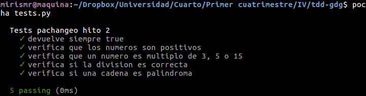
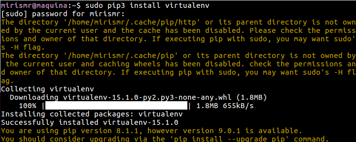
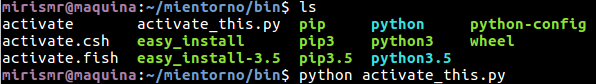
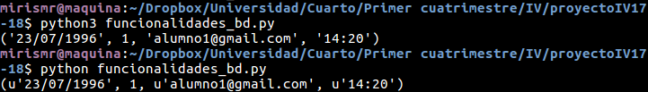

# Ejercicios tema 2

## Ejercicio 1: Hacer un pull request a este proyecto con tests adicionales, si es que faltan (en el momento que se lea este tema)
Ejecutamos el comando `git clone git@github.com:mirismr/tdd-gdg.git` para clonar el repositorio. Y añadimos algunos tests de prueba:
~~~
def testDivision(self):
    self.assertEqual(division(1, 0), -1, "Division correcta")
    self.assertEqual(division(4, 2), 2, "Division correcta")

def testPalindromo(self):
    self.assertEqual(palindromo("hola"), False)
    self.assertEqual(palindromo("aba"), True)
    self.assertEqual(palindromo(1), False)
~~~

Para las funciones:
~~~
def division(a, b):
    if b == 0:
        return -1

    return a/b

def palindromo(cadena):
    if type(cadena) is int or type(cadena) is float:
        return False

    return cadena == cadena[::-1]
~~~

## Ejercicio 2: Para la aplicación que se está haciendo, escribir una serie de aserciones y probar que efectivamente no fallan. Añadir tests para una nueva funcionalidad, probar que falla y escribir el código para que no lo haga (vamos, lo que viene siendo TDD).
Realizado en el ejercicio 1.

## Ejercicio 3: Convertir los tests unitarios anteriores con assert a programas de test y ejecutarlos desde mocha, usando descripciones del test y del grupo de test de forma correcta. Si hasta ahora no has subido el código que has venido realizando a GitHub, es el momento de hacerlo, porque lo vas a necesitar un poco más adelante.
Yo he usado [Pocha](https://github.com/rlgomes/pocha), una versión de *Mocha* para Python. Podemos seguir la instalación en el link anterior.
Usaré la función *it* para describir los tests.

Así pues, ahora la clase `SoloTest()` que teníamos anteriormente queda de la siguiente forma:

~~~

class SoloTest():
        
    @it('devuelve siempre true')
    def testTrue():
        assert devuelveTrue() == True 

    @it('verifica que los numeros son positivos')
    def testSuma():
    assert sumaPositivos(4,8) == 12
        
    @it('verifica que un numero es multiplo de 3, 5 o 15')
    def testMultiplos():
        assert multiplo3o5o15(3) == 1
        assert multiplo3o5o15(5) == 2
        assert multiplo3o5o15(15) == 3
        assert multiplo3o5o15(7) == 0

    @it('verifica si la division es correcta')
    def testDivision():
        assert division(1, 0) == -1
        assert division(4, 2) == 2

    @it('verifica si una cadena es palindroma')
    def testPalindromo():
        assert palindromo("hola") == False
        assert palindromo("abba") == True
        assert palindromo(1) == False 
~~~

Y al ejecutar el comando `pocha tests.py`, nos saldrá algo similar a la siguiente figura:

## Ejercicio 4: Instalar alguno de los entornos virtuales de node.js (o de cualquier otro lenguaje con el que se esté familiarizado) y, con ellos, instalar la última versión existente, la versión minor más actual de la 4.x y lo mismo para la 0.11 o alguna impar (de desarrollo).

Yo he usado *virtualenv*, ya que estoy usando Python para el desarrollo de los ejercicios y el proyecto.

Para instalarlo usamos el comando:
`sudo pip install virtualenv`

Podemos ver las versioes disponibles introducimos el comando:
`virtualenv -p /usr/bin/python`

Una vez instalado, podemos crear nuestro entorno virtual con el comando:
`virtualenv mientorno`

Y lo ponemos en marcha con el comando:
`. bin/activate`

El proceso se muestra en las siguiente figuras:

La guía de uso se puede encontrar en el siguiente [enlace](https://virtualenv.pypa.io/en/latest/userguide/#). 
 

## Ejercicio 5: Como ejercicio, algo ligeramente diferente: una web para calificar las empresas en las que hacen prácticas los alumnos.

Para este ejercicio he implementado las funcionalidades correspondientes a mi proyecto personal de la asignatura. Lo podemos ver en el siguiente [enlace](https://github.com/mirismr/proyectoIV17-18)

## Ejercicio 6: Ejecutar el programa en diferentes versiones del lenguaje. ¿Funciona en todas ellas?

El programa inserta ciertos registros en las tablas de la BD y recupera uno de ellos. Como se puede ver en la siguiente imagen, no hay problema de que versión de *Python* usemos:

## Ejercicio 7: Crear una descripción del módulo usando package.json. En caso de que se trate de otro lenguaje, usar el método correspondiente.

Como estoy usando *Python*, hay que configurar el archivo `requirements.txt`. Lo podemos ver en el [repositorio del proyecto](https://github.com/mirismr/proyectoIV17-18).

Para ver las versiones que estamos usando, podemos introducir el comando `pip3 freeze` y, en mi caso, la única dependencia que habría que incluir hasta ahora sería *pocha*, si decido usarlo en el proyecto. 

El archivo quedaría:
~~~
"pocha==0.13.0"
~~~

No obstante, se verá modificado cuando incluyamos diferentes APIs, como por ejemplo la del bot de *Telegram*.
