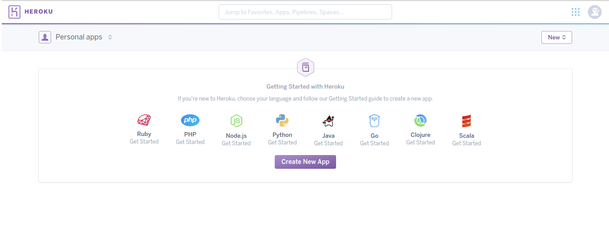
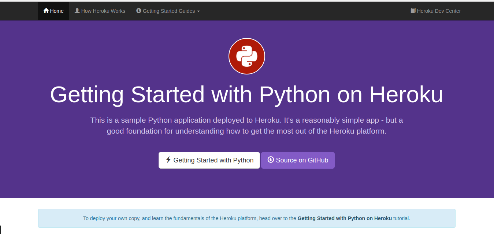

# Ejercicios tema 3

## Ejercicio 1: Darse de alta en algún servicio PaaS tal como Heroku, zeit, BlueMix u OpenShift.
En mi caso me he dado de alta en *Heroku*. Lo hacemos a través de su [página oficial](https://signup.heroku.com/?c=70130000001x9jEAAQ):

Una vez hecho esto, confirmamos la cuenta en el correo y establecemos la contraseña. Se nos redirigirá a la página inicial de *Heroku*:

## Ejercicio 2: Crear una aplicación en OpenShift o en algún otro PaaS en el que se haya dado uno de alta. Realizar un despliegue de prueba usando alguno de los ejemplos incluidos con el PaaS.

Consultamos la introducción que nos ofrece [*Heroku*](https://devcenter.heroku.com/articles/getting-started-with-python#prepare-the-app). Clonamos el repositorio de la app de prueba, creamos la aplicación con `heroku create` y hacemos push `git push heroku master`.

Para abrir la aplicación solo tenemos que ejecutar el comando `heroku open` y nos mostrará la aplicación en el navegador:

