# Ejercicios tema 4

## Ejercicio 1: Instala LXC en tu versión de Linux favorita. Normalmente la versión en desarrollo, disponible tanto en GitHub como en el sitio web está bastante más avanzada; para evitar problemas sobre todo con las herramientas que vamos a ver más adelante, conviene que te instales la última versión y si es posible una igual o mayor a la 1.0.

Descargamos la versión del [repositorio](https://github.com/lxc/lxc) e instalamos las dependencias necesarias. Para ver que todo ha ido correctamente y que nuestro núcleo es compatible, ejecutamos `lxc-checkconfig`:

## Ejercicio 2: Crear y ejecutar un contenedor basado en tu distribución y otro basado en otra distribución, tal como Fedora.

Antes de nada debemos instalar `debootstrap` para las distribuciones *Debian* y `yum` para las distribuciones *Fedora*.

Ejecutamos el comando `lxc-create -t ubuntu -n cont-ubuntu` para crear el contenedor basado en *Debian*:

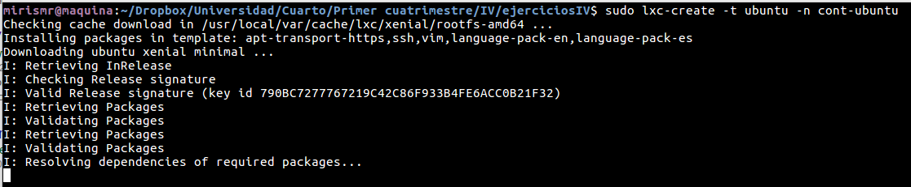

Para crear el contenedor basado en *Fedora*, ejecutamos `lxc-create -t centos -n una-caja-centos`:

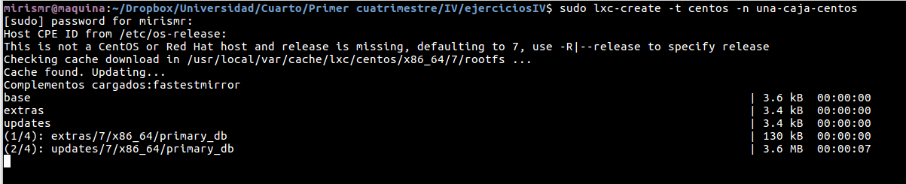

Le cambiamos la contraseña del root tal y como nos pide cuando acabamos la instlación:

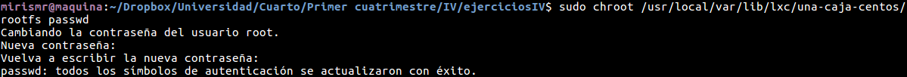

Para poner en marcha cualquiera de los dos, introducimos el comando `lxc-start -n cont-ubuntu` o `lxc-start -n una-caja-centos`:

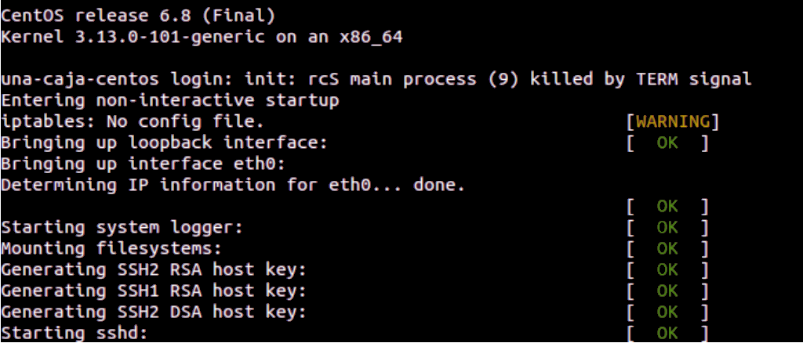

## Ejercicio 3: Instalar docker

Se puede encontrar en la [documentación extra](https://mirismr.github.io/proyectoIV17-18/) del proyecto.

## Ejercicio 4: Instalar a partir de docker una imagen alternativa de Ubuntu y alguna adicional, por ejemplo de CentOS. Buscar e instalar una imagen que incluya MongoDB.

Lo hacemos con los comandos `sudo docker pull ubuntu`,  `sudo docker pull centos` y `sudo docker pull mongo`. Para ver que las imágenes han sido instaladas ejecutamos `sudo docker images`:

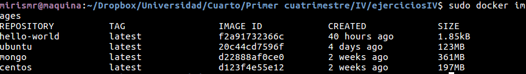

## Ejercicio 5: Crear un usuario propio e instalar alguna aplicación tal como nginx en el contenedor creado de esta forma, usando las órdenes propias del sistema operativo con el que se haya inicializado el contenedor.

Nos conectamos a la máquina con `sudo docker run -i -t ubuntu /bin/bash`.
Una vez dentro, usaremos el comando `adduser` para crear un usuario como es normal en cualquier *Ubuntu*:

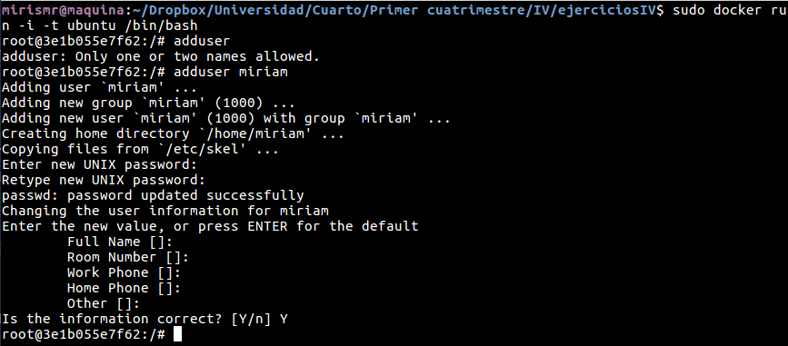

Para instalar *Nginx*, ejecutamos el conocido comando `apt-get install nginx`. Para iniciar *Nginx*, usamos el comando `service nginx start`.

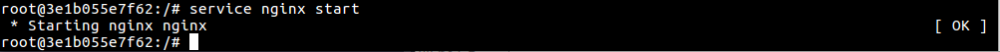

Podemos instalar *Curl* y ejecutar el comando `curl localhost` para comprobar que funciona:

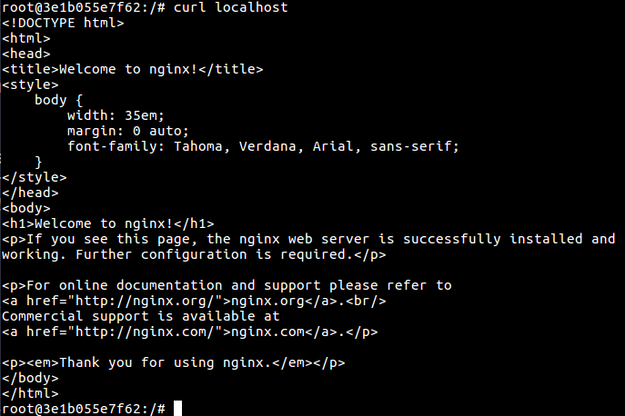

## Ejercicio 6: Crear a partir del contenedor anterior una imagen persistente con commit.

Con el comando `sudo docker ps -a` vemos las ejecuciones de los contenedores:

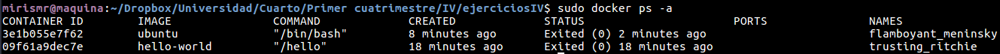

Y escogemos la ID del contenedor de *Ubuntu*: *3e1b055e7f62*, en mi caso, para hacer un commit con el comando `sudo docker commit 3e1b055e7f62 ubuntu-commit`:

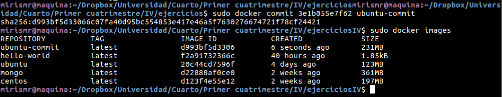

Si ahora arrancamos este nuevo contenedor, deberíamos tener *Nginx* instalado, ya que lo hicimos antes:

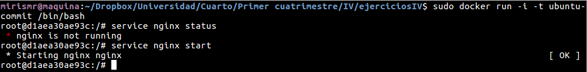