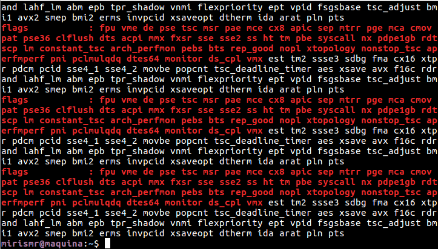

# Ejercicios tema 5

## Instalar los paquetes necesarios para usar KVM. Se pueden seguir estas instrucciones. Ya lo hicimos en el primer tema, pero volver a comprobar si nuestro sistema está preparado para ejecutarlo o hay que conformarse con la paravirtualización.

Consultamos los flags del procesador con el comando: `egrep '^flags.*(vmx|svm)' /proc/cpuinfo`

Seguimos los pasos de la instalación [aquí](https://help.ubuntu.com/community/KVM/Installation):

1. Instalamos con el comando: `apt-get install qemu-kvm libvirt-bin ubuntu-vm-builder bridge-utils`
2. Instalamos *virt-manager* para emplear una interfaz gráfica: `apt-get install virt-manager`
3. Añadimos los usuarios a los grupos con `adduser <youruser> libvirt` y `adduser <youruser> libvirt-qemu`

Comprobamos la instalación:

