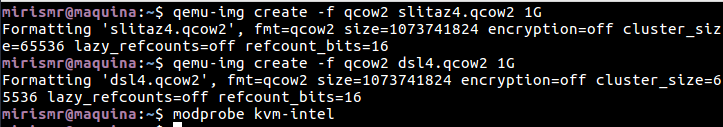

# Ejercicios tema 5

## Ejercicio 1: Instalar los paquetes necesarios para usar KVM. Se pueden seguir estas instrucciones. Ya lo hicimos en el primer tema, pero volver a comprobar si nuestro sistema está preparado para ejecutarlo o hay que conformarse con la paravirtualización.

Consultamos los flags del procesador con el comando: `egrep '^flags.*(vmx|svm)' /proc/cpuinfo`

Seguimos los pasos de la instalación [aquí](https://help.ubuntu.com/community/KVM/Installation):

1. Instalamos con el comando: `apt-get install qemu-kvm libvirt-bin ubuntu-vm-builder bridge-utils`
2. Instalamos *virt-manager* para emplear una interfaz gráfica: `apt-get install virt-manager`
3. Añadimos los usuarios a los grupos con `adduser <youruser> libvirt` y `adduser <youruser> libvirt-qemu`

Comprobamos la instalación:

## Ejercicio2:
### 1. Crear varias máquinas virtuales con algún sistema operativo libre tal como Linux o BSD. Si se quieren distribuciones que ocupen poco espacio con el objetivo principalmente de hacer pruebas se puede usar CoreOS (que sirve como soporte para Docker) GALPon Minino, hecha en Galicia para el mundo, Damn Small Linux, SliTaz (que cabe en 35 megas) y ttylinux (basado en línea de órdenes solo).
Instalaré  *Damn Small Linux* y *SliTaz*. Para ello creamos los discos donde instalaremos los SOs y cargamos el módulo:

Una vez hecho esto, nos descargamos las .iso de los SOs y lo instalamos:

### 2. Hacer un ejercicio equivalente usando otro hipervisor como Xen, VirtualBox o Parallels.

Lo he hecho con el hipervisor *VirtualBox*. Creamos la máquina y le indicamos las características que deseemos, como es un SO muy ligero con poco "hardware" irá bien:

Una vez hecho esto, en la configuración de la máquina elegimos la .iso con la que instalaremos el SO:

Y arrancamos:

## Ejercicio 4: Crear una máquina virtual Linux con 512 megas de RAM y entorno gráfico LXDE a la que se pueda acceder mediante VNC y ssh.
miri
En este caso instalaremos *Lubuntu* con *VirtualBox*. Seguimos los pasos del ejercicio anterior e instalamos la máquina.

A continuación instalaremos ssh para poder acceder con `sudo apt-get install openssh-server`:

Una vez hecho esto, vemos la ip de la máquina virtual y nos conectamos con `ssh usuario@ip`:

## Ejercicio 5: Crear una máquina virtual ubuntu e instalar en ella alguno de los servicios que estamos usando en el proyecto de la asignatura.

Se ha hecho en el proyecto de la asignatura y está explicado en la [documentación] (https://mirismr.github.io/proyectoIV17-18/)
