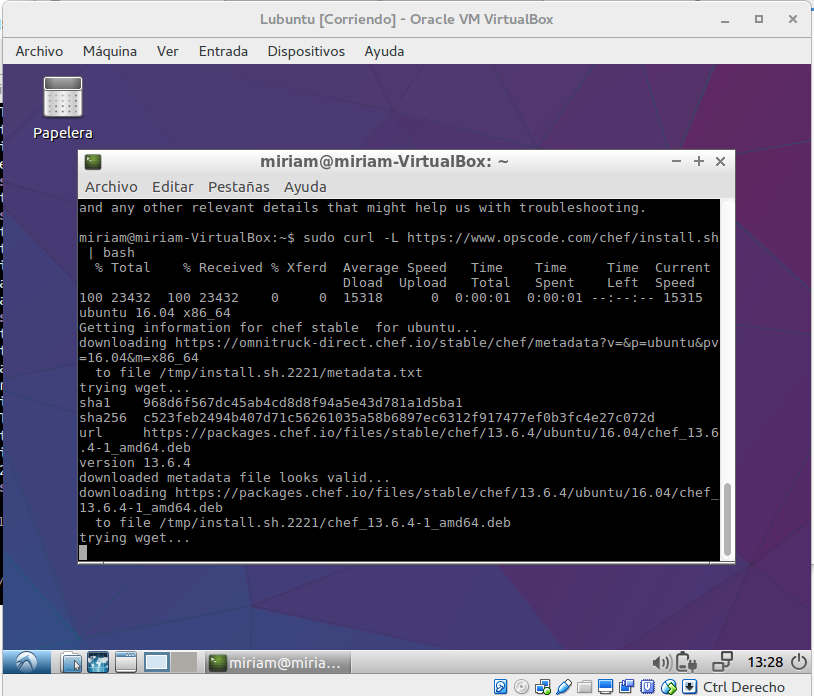
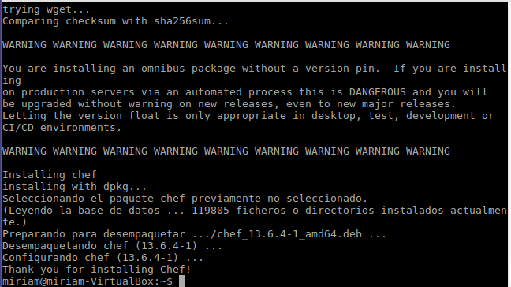

# Ejercicios tema 6

## Ejercicio 1: Instalar chef-solo en la máquina virtual que vayamos a usar
Usaré la máquina virtual *Lubuntu* instalada para los ejercicios del tema 5.

Instalamos con el comando: `sudo curl -L https://www.opscode.com/chef/install.sh | bash`:

## Ejercicio 2: Crear una receta para instalar la aplicación que se viene creando en la asignatura en alguna máquina virtual o servidor en la nube.

Se ha hecho en el proyecto de la asignatura y está explicado en la [documentación] (https://mirismr.github.io/proyectoIV17-18/)